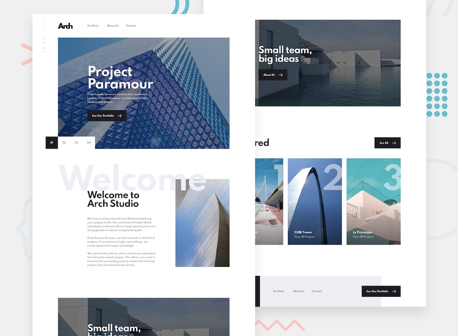

## About

Multi page website built as a solution to the [Frontend Mentor challenge](https://www.frontendmentor.io/challenges/arch-studio-multipage-website-wNIbOFYR6). 

## ⚡ Demo

Here is a working live demo: arch-studio-fm.herokuapp.com/

## ✨ Built with

* React.js with Hooks
* React Router
* React Scroll
* Styled Components
* React Leaflet - React components for Leaflet maps
* React Slick - Carousel component built with React
* React Transition Group - React component toolset for managing animations.
* EmailJS - Service that allows us to send emails directly from your client-side JavaScript code
